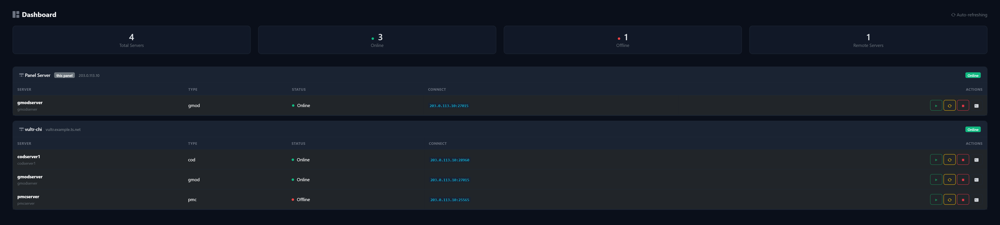
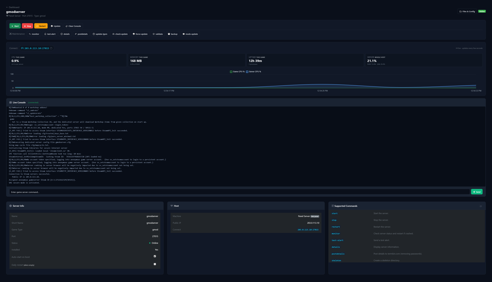
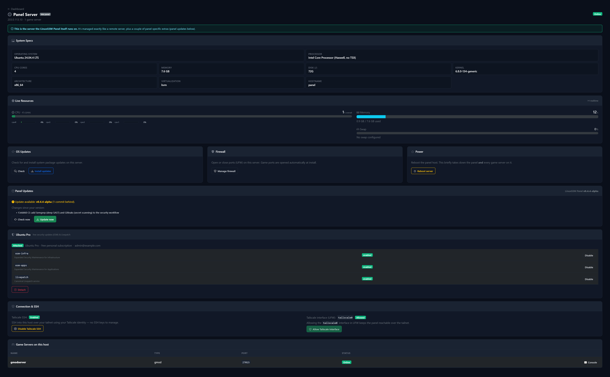
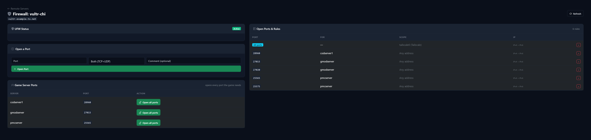
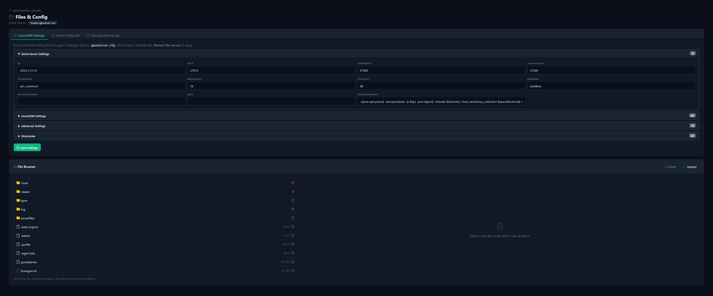
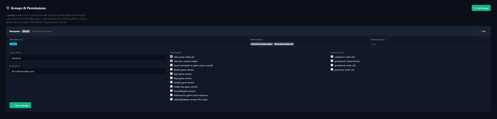

# LinuxGSM Panel 🎮

[](https://scorecard.dev/viewer/?uri=github.com/FMSMITH91/linuxgsm-panel) [](https://app.codacy.com/gh/FMSMITH91/linuxgsm-panel/dashboard?utm_source=gh&utm_medium=referral&utm_content=&utm_campaign=Badge_grade)

[](https://github.com/FMSMITH91/linuxgsm-panel/actions/workflows/ci.yml) [](https://github.com/FMSMITH91/linuxgsm-panel/actions/workflows/codeql.yml) [](https://github.com/FMSMITH91/linuxgsm-panel/actions/workflows/security.yml) [](https://github.com/FMSMITH91/linuxgsm-panel/actions/workflows/lighthouse.yml) [](LICENSE) [](https://www.python.org)

> ## ⚠️ Disclaimer — please read first
>
> - **This is NOT an official LinuxGSM product or website.** It is an independent, third‑party web panel and is **not affiliated with, sponsored by, endorsed by, or connected to [LinuxGSM](https://linuxgsm.com) or its creator/maintainers** in any way. "LinuxGSM" is the name of the separate open‑source project this panel automates; all rights and trademarks belong to their respective owners.
> - **This panel was created and modified almost entirely by AI.** Treat it accordingly — read the code yourself and test it before trusting it with real servers or credentials.
> - **Use entirely at your own risk.** Provided "as is", with no warranty of any kind. See [Security](#security) for important notes (including how remote SSH credentials are stored).

A self-hosted web panel for managing **LinuxGSM** game servers on remote VPS machines. Full role-based access control with granular permissions — super admins, server admins, and moderators.

> **🔒 Built-in Tailscale integration** — auto-detects your Tailscale status, one-click **private** Serve
> setup (tailnet-only, free on the Personal plan), MagicDNS URL discovery, and peer reachability checking
> for your remote nodes.

## What you need

> ⚠️ **Ubuntu 24.04 only, for now.** The panel is currently built and tested against **Ubuntu 24.04 LTS** — that's the only supported OS at the moment (other distros may work but aren't supported yet).

- **A host running Ubuntu 24.04 to run the panel on.** The installer sets up everything else it needs (Python 3.11+, a virtualenv, and dependencies) automatically, so you don't have to install them yourself.
- **One or more game-server machines (Ubuntu 24.04) you can reach over SSH** (key, password, or Tailscale SSH). The panel host can also manage itself.
- **LinuxGSM** on those machines — or let the panel install it for you.
- *Optional but recommended:* **[Tailscale](https://tailscale.com)** for private, HTTPS access with no open ports.

## Quick Install

One command installs the panel — and re-running the **same command** later updates it in place:

```bash
curl -fsSL https://raw.githubusercontent.com/FMSMITH91/linuxgsm-panel/main/install.sh | bash
```

- **Meant for a brand-new server:** a *fresh* install first brings the whole OS up to date (`apt full-upgrade`), installs the panel, then **reboots** — baking in the update and proving the box boots cleanly (the panel starts on boot, so it's back in ~1 min). *Updates* (re-running the command) are panel-only and don't reboot — **unless** they find pending OS updates, in which case they apply those and reboot too. Skip all of this with `PANEL_NO_UPGRADE=1`.
- Run as a normal user → installs under that user as a `systemd --user` service.
- Run as **root** → the panel is **not** run as root; the installer creates a dedicated non-login service user and runs it as a system service.
- Serves HTTPS out of the box with a built-in self-signed certificate; auto-detects Tailscale and offers a **trusted** certificate via Tailscale Serve during the setup wizard.

**Then open `https://your-server:5000`** — you'll see a one-time "not private" browser warning (that's the built-in self-signed cert; click **Advanced → Proceed**), and the first visit runs the setup wizard that walks you through the rest. *(An `http://` address won't load — the panel speaks TLS.)*

That's it. The sections below are reference for when you want them.

### Safe, self-healing updates

Re-running the command on an existing install performs a **verified update**: it snapshots the current code **and** database, pulls the new version, restarts the service, and **health-checks** that the panel actually comes back up. If it doesn't, it **automatically rolls back** to the previous version — code and database — so a bad release can't leave you with a dead panel. The command is idempotent; run it as often as you like.

```bash
# Later, to update (same command — installs or updates):
curl -fsSL https://raw.githubusercontent.com/FMSMITH91/linuxgsm-panel/main/install.sh | bash
```

Prefer a checkout? `git clone` then `bash install.sh` does exactly the same thing, and `bash install.sh` again updates it.

Or install manually:

```bash
# Create environment
python3 -m venv venv
source venv/bin/activate
pip install -r requirements.txt

# Run
python app.py
```

### Uninstalling

The panel ships an uninstaller that removes **only the panel** — its service, files, data, sudoers entry, and (for a root install) the dedicated `lgsmpanel` user. **Your game servers are left completely intact** — their Linux users, files, and autostart are never touched, so they keep running.

```bash
# root/system install
sudo bash ~lgsmpanel/linuxgsm-panel/uninstall.sh

# per-user install
bash ~/linuxgsm-panel/uninstall.sh
```

It asks you to type `yes` first (add `--yes` to skip the prompt).

## Features

### Game servers
- **📦 Install any LinuxGSM game** — one-click install of any LinuxGSM-compatible server (Garry's Mod, Minecraft, CS2/CS:Source, TF2, ARMA 3, Rust, and 130+ more, straight from LinuxGSM's own game list). The panel can install LinuxGSM itself, then auto-detects and opens every port the game needs.
- **🖥️ Live console & stats** — real-time WebSocket console streaming, send commands to the running game, and per-game CPU/RAM/uptime tiles with a live resource graph.
- **🛑 Full, player-aware control** — start, stop, restart, update, validate, monitor, and the game's other LinuxGSM commands from the web UI. **Restart and stop check who's online first** — if players are connected, they warn you and offer to *wait until the server is empty* instead of disconnecting anyone; rebooting a host warns if any of its servers has players. Installed games are also given a small CPU-priority edge on (re)start.
- **🧩 Mods & addons manager** — browse, install, and remove LinuxGSM-supported mods (SourceMod, MetaMod, Oxide, ULX, and game-specific ones) right from the panel. A pending mod change restarts the server to load it — automatically once it's empty, so players aren't kicked. (Games with no LinuxGSM mods installer simply don't show the section.)
- **📣 Alerts & notifications** — configure LinuxGSM's own alerts (Discord, Telegram, email, Pushover, Pushbullet, Slack, Gotify, IFTTT) per server, with a test button. They fire even if the panel is down.
- **🌐 FastDL** — generate a Source-engine FastDL directory for games that support it.
- **⏰ Scheduled tasks (cron)** — manage a server's cron jobs from the UI, with last-run time, success/failure, and a "run now" button; plus auto-start-on-boot and daily-restart-when-empty toggles.
- **🗂️ Files & config** — grouped LinuxGSM settings, the game's own config file, and a full file browser with drag-and-drop upload, in-browser editing, and delete guards for files LinuxGSM/the game needs.

### Backups
- **💾 Panel backups** — one-click and automatic daily backups of the panel's database, settings, and encryption keys, with retention, download, and one-click restore.
- **🎮 Game-server backups** — LinuxGSM full backups per server, on-demand or on a schedule, browsable in a table (by filename) with per-backup **download** and **delete**. **Player-aware:** a server with people on it is skipped and queued to back up once it empties (rather than kicking them) — unless you choose to back up now.
- **📅 Per-server schedules** — a global default (daily / weekly / fortnightly / monthly + keep-count) that each server can override or turn off individually.
- **📊 Disk-aware & explained** — shows free disk, estimates how much a retention setting will use, warns before it gets tight, frees space for a new backup when the disk is nearly full, and won't start a backup that can't fit — all in plain language.

### Access, security & hosts
- **🔐 Multi-user RBAC** — Super Admin, Server Admin, Moderator, Viewer. Define groups with granular per-action permissions and per-server access; users inherit the combined set, enforced server-side on every endpoint.
- **🔗 Tailscale native** — auto-detect Tailscale status, one-click private Serve setup (tailnet-only, free tier), MagicDNS URL, SSH-over-tailnet, peer reachability checker, and auto-setup on first run. (Public Funnel exposure is an optional, clearly-warned advanced toggle.)
- **🔌 Multiple remote VPS** — manage game servers across many machines via SSH key, password, or Tailscale SSH, with SSH host-key pinning.
- **🖧 Host management** — the *same* page for the panel host and every remote: hardware/OS specs, live per-core resources, OS updates, UFW firewall, power controls, Ubuntu Pro (free ESM + Livepatch), one-click SSH lockdown, and changing the panel's own web port/bind address.
- **🩺 Diagnostics & self-heal** — verify the panel's own file integrity against the installed version and restore altered files in one click; generate a debug report; safe self-healing panel updates.
- **🔒 Secure by default** — HTTPS out of the box (built-in self-signed cert, or a trusted cert via Tailscale/reverse proxy), optional TOTP two-factor auth with backup codes, revocable sessions, CSRF protection + security headers, and passwords hashed with bcrypt.

### Everything else
- **🪶 Light on small VPSes** — the panel runs at low CPU/IO priority so it yields to your game servers under load, tunes the host to prefer RAM over swap, and caches/skips needless work — so a 1-core box stays responsive for players.
- **🌍 Multi-language** — English, Spanish, and French, with a language switcher and a saved per-user preference. (Untranslated strings fall back to English.)
- **📋 Audit logging** — every action logged with user, IP, target, and timestamp.
- **⚡ Setup wizard** — first-run wizard for site config, admin creation, and remote VPS connection; auto-configures Tailscale Serve if detected.
- **🔌 REST API** — JSON API for server status, console, and commands.

## Screenshots

> ℹ️ IP addresses, hostnames, and account details in these screenshots are **redacted** with
> placeholder values (`203.0.113.10`, `example.ts.net`, `admin@example.com`).

**Dashboard** — every game server across every host, at a glance.



**Live console & per-game stats** — real-time WebSocket console streaming, per-game CPU/RAM/uptime tiles, and a live resource graph.



**Host manager** — the *same* page for the panel host and every remote: hardware/OS specs, live per-core resources, OS updates, firewall, power, Ubuntu Pro (free ESM + Livepatch), and one-click panel self-updates.



**Firewall** — raw UFW rules parsed into clean columns with IPv4/IPv6 merged, plus one-click opening of every port a game needs.



**Files & config** — grouped LinuxGSM settings, the game's own config file, and a full file browser with drag-and-drop upload, in-browser editing, and delete guards that protect files LinuxGSM/the game needs.



**Granular permissions** — groups bundle per-action permissions with per-server access; a user inherits the combined set. Enforcement is server-side on every endpoint.



## Configuration

Configuration is stored in `data/config.json` after the setup wizard runs. Key settings:

| Setting | Default | Description |
|---------|---------|-------------|
| `site_title` | LinuxGSM Panel | Display name for the panel |
| `site_domain` | (empty) | Public domain, for reverse proxy setup |
| `port` | 5000 | Web server port |
| `bind_host` | 0.0.0.0 | Bind address (use `127.0.0.1` behind nginx) |
| `session_lifetime_hours` | 8 | Idle session timeout (sliding) |
| `remember_days` | 3 | "Remember me" cookie lifetime, if "remember me" is ticked |
| `ssh_timeout` | 10 | SSH connection timeout in seconds |

## Permission Groups

The panel uses a flexible group-based permission system:

| Permission | Description |
|------------|-------------|
| `view_servers` | See server status on dashboard |
| `view_console` | View live console output |
| `send_command` | Send commands to game server console |
| `restart_server` | Restart game servers |
| `start_server` | Start game servers |
| `stop_server` | Stop game servers |
| `update_server` | Update game servers |
| `install_server` | Install new game servers |
| `uninstall_server` | Uninstall/decommission servers |
| `manage_servers` | Add/remove game server definitions |
| `manage_remotes` | Add/edit/delete remote VPS nodes |
| `manage_users` | Manage user accounts |
| `manage_groups` | Manage groups and permissions |
| `view_logs` | View audit logs |
| `super_admin` | Full system administrator access |

### Suggested Group Setup

- **Super Admin** — All permissions (auto-granted via `is_superadmin` flag, no group needed)
- **Admins** — `view_servers`, `view_console`, `send_command`, `start_server`, `stop_server`, `restart_server`, `update_server`, `manage_servers`
- **Moderators** — `view_servers`, `view_console`, `send_command` (on specific servers)
- **Viewers** — `view_servers` only

## API

The panel provides a JSON API for integration. It serves HTTPS by default, so use `https://` (add `-k` to `curl` for the self-signed cert) — or `http://` only when a proxy/Tailscale terminates TLS in front of it. Every call needs an authenticated session cookie.

```bash
# List servers (requires auth cookie)
curl http://localhost:5000/api/servers

# Get server status
curl http://localhost:5000/api/server/1

# Get console output
curl http://localhost:5000/api/console/1

# Send command (POST)
curl -X POST http://localhost:5000/api/command/1 \
  -H "Content-Type: application/json" \
  -d '{"command":"status"}'
```

## Production Deployment

### Behind Nginx

```nginx
server {
    listen 443 ssl;
    server_name panel.example.com;

    location / {
        proxy_pass http://127.0.0.1:5000;
        proxy_http_version 1.1;
        proxy_set_header Upgrade $http_upgrade;
        proxy_set_header Connection "upgrade";
        proxy_set_header Host $host;
        proxy_set_header X-Real-IP $remote_addr;
        proxy_read_timeout 86400;
    }
}
```

Behind a reverse proxy, set `"trust_proxy": true` and `"bind_host": "127.0.0.1"` in `data/config.json`: the panel then serves plain HTTP to the proxy (which terminates TLS with a real certificate) and trusts its `X-Forwarded-*` headers. See [docs/https.md](docs/https.md).

### With Tailscale (Recommended)

If Tailscale is installed, the panel auto-detects it during the setup wizard. You can also manage Tailscale Serve from the web UI at `/tailscale`.

```bash
# One-click setup from the web UI:
# Navigate to /tailscale and click "Enable Serve"
# Or use the CLI directly:
tailscale serve --bg --https 443 http://127.0.0.1:5000

# Make it public (Tailscale Funnel):
tailscale funnel --bg --https 443 http://127.0.0.1:5000
```

**Tailscale features in the panel:**
- **Auto-detection** — Status, IPs, MagicDNS, peer count shown on the Tailscale page
- **One-click Serve/Funnel** — Enable/disable from the UI without touching the CLI
- **Peer Reachability Check** — Ping any host on the tailnet before adding it as a remote VPS
- **Auto-setup** — If Tailscale is running during first-time setup, Serve is configured automatically
- **MagicDNS URL** — Shown in the dashboard, startup logs, and setup completion page
- **Peer List** — See all connected devices with hostname, IP, OS, and status

### With systemd (installed by default)

```bash
systemctl --user enable --now linuxgsm-panel
```

## Security

- **HTTPS by default** — a fresh install serves HTTPS immediately with a built-in, long-lived self-signed certificate (no config needed). Set up Tailscale Serve or a reverse proxy for a **trusted** (no-warning) certificate. See [docs/https.md](docs/https.md).
- Passwords are **bcrypt-hashed**; new passwords require length plus mixed case, a number and a symbol, and logins are rate-limited.
- **Optional two-factor authentication (TOTP)** — enable per account from the Account page; works with any authenticator app.
- **Hardened, revocable sessions** — signed, `HttpOnly`, `SameSite=Lax`, `Secure`-over-HTTPS cookies with a sliding idle timeout and a capped "remember me" window. Logging out, changing a password, or "sign out everywhere" **instantly invalidates every session and remember cookie server-side**; sessions are also bound to client IP + User-Agent.
- **Secrets are encrypted at rest** — remote SSH credentials and other sensitive fields are stored encrypted in `data/panel.db` (key in `data/cred_key`). The session key and these files are kept owner-only (`chmod 600`).
- **SSH host-key pinning** — the panel records each host's SSH key on first connect and refuses to connect if it later changes (man-in-the-middle protection); a reinstalled host can be re-trusted with one click. Tailscale SSH uses the system `ssh` client with **no stored credentials at all** (recommended).
- **Role-based access control is enforced server-side on every route** — not just hidden in the UI. Server access is scoped per host, and automated tests verify the enforcement.
- **CSRF protection, a strict Content-Security-Policy, and security headers** (HSTS over HTTPS, `X-Frame-Options`, `X-Content-Type-Options`, `Referrer-Policy`) are applied to every response.
- Input that becomes shell/OS operations is strictly validated; audit logging records the acting user, real client IP, target, and result of sensitive actions.
- **Locked out?** Reset a forgotten password (even the sole superadmin's), recover 2FA, or restore an admin from a shell on the panel host — no web login needed. See [Recovery](#recovery--forgot-your-password-or-locked-out).
- Super admins bypass all permission checks — use that role sparingly.

> **Operational note:** run the panel behind Tailscale (tailnet-only, no open ports) rather than exposing it to the public internet, and never commit `data/` to version control — it holds `panel.db`, `secret_key`, `cred_key`, and `config.json` (already in `.gitignore`).

### Recovery — forgot your password or locked out?

**One command, from anywhere on the panel host** — no `cd`, no paths, no venv. It finds your install and runs as the panel's own user:

```bash
sudo linuxgsm-panel-recover              # reset the sole superadmin's password
```

Other recovery actions use the same command:

```bash
sudo linuxgsm-panel-recover reset-password <user>   # a specific user
sudo linuxgsm-panel-recover disable-2fa <user>       # lost your authenticator
sudo linuxgsm-panel-recover create-admin <user>      # no superadmin left (or: promote / activate <user>)
sudo linuxgsm-panel-recover list-users
```

You're prompted for anything needed (passwords are never echoed), and existing sessions are revoked on a password reset. It works even when you can't log in — the CLI talks straight to `data/panel.db`. Run `sudo linuxgsm-panel-recover --help` for the full list.

Don't have the command yet (older install), or prefer the installer-style one-liner? This does the same:

```bash
curl -fsSL https://raw.githubusercontent.com/FMSMITH91/linuxgsm-panel/main/recover.sh | sudo bash
# with an action:   curl -fsSL .../recover.sh | sudo bash -s -- disable-2fa alice
```

## Development

```bash
git clone https://github.com/FMSMITH91/linuxgsm-panel.git
cd linuxgsm-panel
python3 -m venv venv
source venv/bin/activate
pip install -r requirements.txt
python app.py
```

## License

MIT
