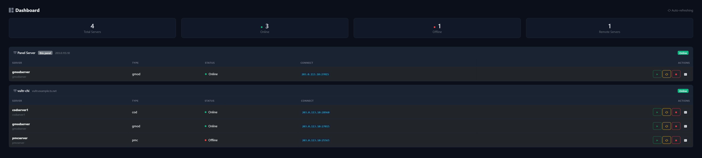
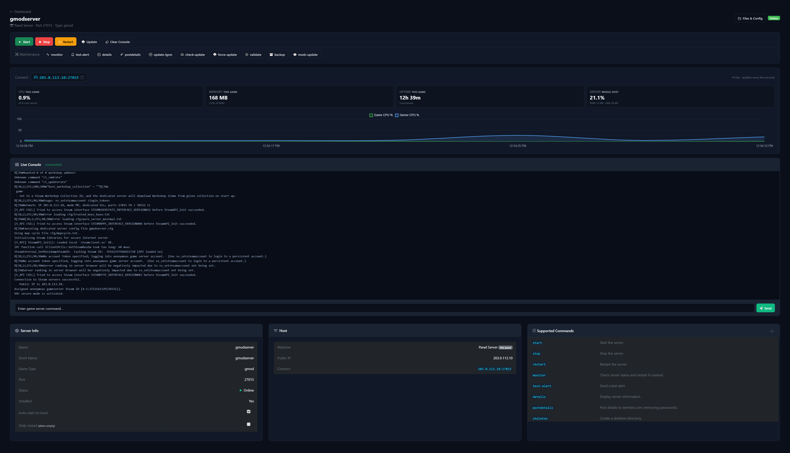
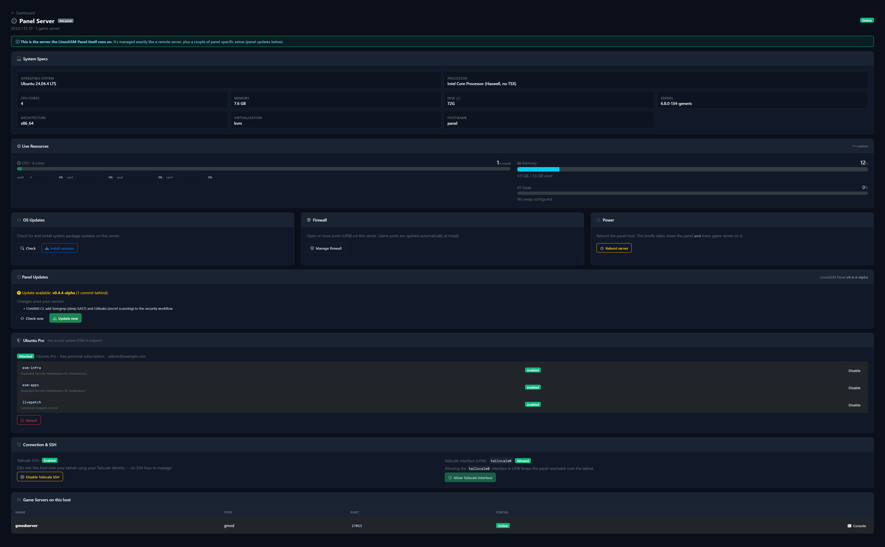
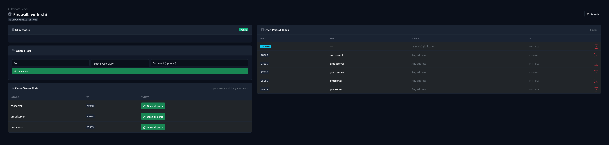
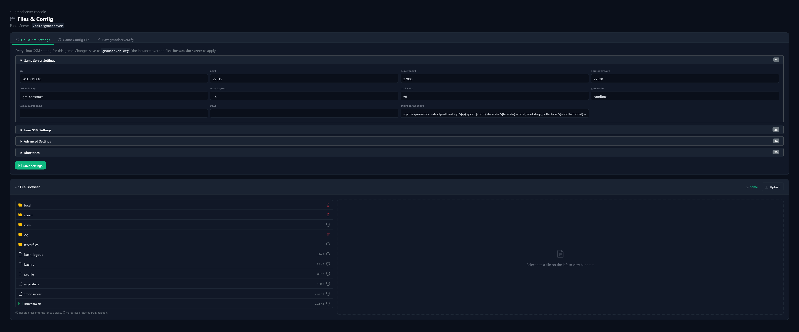
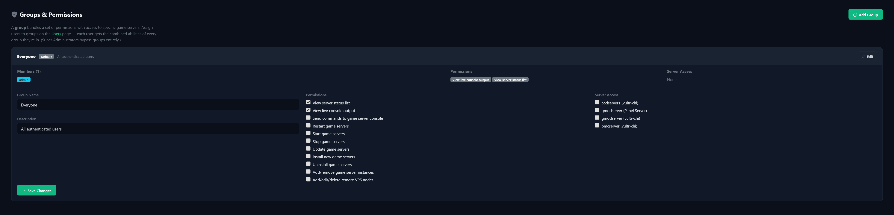

# LinuxGSM Panel 🎮

[](https://scorecard.dev/viewer/?uri=github.com/FMSMITH91/linuxgsm-panel) [](https://app.codacy.com/gh/FMSMITH91/linuxgsm-panel/dashboard?utm_source=gh&utm_medium=referral&utm_content=&utm_campaign=Badge_grade)

[](https://github.com/FMSMITH91/linuxgsm-panel/actions/workflows/ci.yml) [](https://github.com/FMSMITH91/linuxgsm-panel/actions/workflows/codeql.yml) [](https://github.com/FMSMITH91/linuxgsm-panel/actions/workflows/security.yml) [](https://github.com/FMSMITH91/linuxgsm-panel/actions/workflows/security-code.yml) [](https://github.com/FMSMITH91/linuxgsm-panel/actions/workflows/codeql-alerts.yml) [](LICENSE) [](https://www.python.org)

A self-hosted web panel for managing **[LinuxGSM](https://linuxgsm.com)** game servers across one or more Ubuntu machines, with role-based access for super admins, server admins, and moderators.

📓 [Changelog](docs/CHANGELOG.md) · 🔒 [Security policy](.github/SECURITY.md) · 🔐 [HTTPS setup](docs/https.md)

> ## ⚠️ Disclaimer — please read first
>
> - **Not an official LinuxGSM product** — an independent third-party panel, not affiliated with, endorsed by, or connected to LinuxGSM or its authors. "LinuxGSM" and any related marks belong to their respective owners.
> - **Created and modified almost entirely by AI.** Read the code and test it before trusting it with real servers or credentials.
> - **Provided "as is", no warranty — use at your own risk.** See [Security](#security).

## Requirements

- A host running **Ubuntu 22.04, 24.04 or 26.04 LTS** for the panel (CI tests all three, each on the Python that release ships — 3.10, 3.12 and 3.14; other distros may work but aren't supported).
- One or more game-server machines on the same, reachable over SSH (key, password, or Tailscale SSH). The panel host can also manage itself.
- **LinuxGSM** on those machines, or let the panel install it.
- *Optional:* **[Tailscale](https://tailscale.com)** for private HTTPS with no open ports.

## Quick install

```bash
curl -fsSL https://raw.githubusercontent.com/FMSMITH91/linuxgsm-panel/main/install.sh | bash
```

**What the installer does** — one command, unattended:

1. Installs the prerequisites it needs (`python3-venv`, `pip`, `git`, `curl`).
2. Patches the OS with `apt full-upgrade` — skip with `PANEL_NO_UPGRADE=1 bash install.sh`.
3. Clones the repo, builds a Python virtualenv, and installs the panel's dependencies.
4. Picks a free port (5000 by default) and records it in `data/config.json`.
5. Sets up the service — **and never runs the panel as root**:
   - **As a normal user** → a `systemd --user` service with linger, so it survives logout/reboot.
   - **As root** → creates a dedicated non-login **`lgsmpanel`** user, runs a *system* service as that user, and adds a *scoped* passwordless-sudo entry so it can manage the local host (create game-server users, `apt`, `ufw`…). Also installs the `linuxgsm-panel-recover` command. Remove the sudoers entry if this panel only ever manages *remote* servers.
6. Leaves the **host terminal**'s `sudo` alone. The panel user's grant names only its privileged
   helper, so `sudo` in a terminal on the panel host *refuses* rather than prompting. To allow it,
   re-run the installer with `PANEL_TERMINAL_SUDO=1` and give the panel user a password
   (`sudo passwd lgsmpanel`) — sudo then asks for that password every time, and
   `PANEL_TERMINAL_SUDO=0` removes the grant again. Worth knowing before you enable it: you would
   be typing that password into a terminal the panel itself renders, so it protects you against a
   stolen panel session, not against a compromised panel. Remote hosts are untouched by this —
   whatever their own account already has is what applies.
7. Serves HTTPS with a built-in self-signed cert (a trusted Tailscale Serve cert is offered in the wizard), then **reboots**.

Then finish in the browser: open **the link the installer prints at the end** — `https://your-server:5000/setup?token=…` (`http://` won't load — it's TLS-only) — accept the one-time cert warning (**Advanced → Proceed**), and the **setup wizard** creates your first super admin.

The token in that link is what makes the install yours. Until the first admin exists the wizard answers only to a browser that has shown it, so nobody else who reaches the port first can create that account. It is single-use: it is deleted once the admin exists. Lost the link? `sudo linuxgsm-panel-recover setup-token` prints it again (or open `/setup` and paste the token).

### Updating

Trigger it one of two ways:

- **In the panel:** *Panel Server → Update*. This is **CI-gated** — it only moves to a commit whose checks have all passed — and runs detached so it survives its own restart. Also available via the Telegram/Discord `/update` command.
- **From the shell:** re-run the same command (or `bash install.sh` from the checkout). A manual re-run pulls the branch tip directly (not CI-gated), so do it when you know the tip is good.

**Versions are dates.** The panel's version is the date of the commit it runs, in UTC, written without leading zeros: `2026.9.26`. It is always shown with the short commit (`2026.9.26 · a1b2c3d` in the footer), because every commit made on the same day shares the date. Nothing is bumped by hand; a copy downloaded as a ZIP from GitHub reads the date from its `VERSION` file, which git fills in when it builds the archive.

**What the updater does** — the same safe path either way:

1. **Checks if there's anything to do.** If you're already on the target version it stops here — no snapshot, panel left running. A commit the panel already contains leaves it where it is. It also stops here, saying "Not updated: held at …" and why, when the commit it was given cannot be verified, or would move the panel sideways rather than forward. An in-panel update that stops at this step (that, or an unreachable update source) is reported on the update card with the installer's reason.
2. **Snapshots the current code *and* database** to a timestamped backup (keeps the last 3).
3. **Checks and optimises the database** with the service stopped (the snapshot from step 2 is the fallback if anything goes wrong).
4. **Fetches the new version** — the CI-verified commit for an in-panel update, the branch tip for a manual re-run.
5. **Installs dependencies** — but only if `requirements.txt` or `requirements-bootstrap.txt` (pip itself, which is installed hash-checked from that file before anything else) actually changed, so a code-only update doesn't rebuild anything.
6. **Starts the service** back up.
7. **Health-checks that the panel answers.** On success it prunes old snapshots; on failure it **auto-rolls-back the code *and* database** to the snapshot — so a broken release can't leave you with a dead panel.

On a root / system install, the updater also refreshes the root-owned pieces in `/usr/local/lib/linuxgsm-panel` (the privileged helper, the offline database tool, gamedig's lockfile and install script, and the installer itself). It takes them from `main` only when the panel starts the update, and never from a commit of `main` older than the last one it installed them from. If you switch the panel to another branch, its code moves but those pieces stay as they were. To take them from a branch on purpose, run `cd / && sudo PANEL_BRANCH=<branch> bash /usr/local/lib/linuxgsm-panel/install.sh` yourself over SSH (not in the panel's own terminal, which counts as the panel). [SECURITY.md](.github/SECURITY.md) explains why.

## Uninstall

```bash
sudo bash ~lgsmpanel/linuxgsm-panel/uninstall.sh   # root / system install
bash ~/linuxgsm-panel/uninstall.sh                 # per-user install
#   add --yes to skip the "type yes to confirm" prompt
```

**What the uninstaller does:**

1. **Detects** whether it's a root/system install or a per-user one (and refuses to run without `sudo` on a root install).
2. **Asks you to confirm** — type `yes` (or pass `--yes`); anything else aborts with nothing changed.
3. **Stops, disables, and removes** the systemd service and its priority drop-in.
4. Removes the panel's **own** UFW port rule — never a game-server port — and every Tailscale Serve route that pointed at the panel's port, one at a time with `tailscale serve --https=<port> --set-path=<mount> off`. Other apps' Serve routes are left alone, and if Serve's config can't be read nothing is removed and it says so. (Both install kinds.)
5. **Deletes the panel files and its `data/`** — accounts, config, and encryption keys.
6. **(Root install)** Removes everything the installer put outside the panel directory: the sudoers entry, the root-owned helper directory (`/usr/local/lib/linuxgsm-panel`, which holds the panel's gamedig install too), the `/usr/local/bin/gamedig` and `/usr/bin/gamedig` links into it (only when they point there), the `linuxgsm-panel-recover` command, the weekly gamedig cron, the panel's sysctl tuning, and the dedicated `lgsmpanel` user.

**Your game servers are left completely alone** — their Linux users, home directories, LinuxGSM installs, `@reboot` autostart crontabs, and game-port firewall rules are never touched, so every server keeps running exactly as before once the panel is gone.

### Removing a host

Deleting a host on **Remote Servers** (the trash button) makes the panel forget it and its game servers. The panel does not connect to the host to do that, so nothing on the host changes: its game servers, their accounts, files and crontabs, keep running as before. The panel's daily gamedig pass works only through the hosts the panel still has, so it stops touching the host at once; a pass already under way skips it too (unless it is working on that very host at that moment, when it finishes that one step).

What the panel put on a remote host, and leaves there:

- **gamedig**, the player-query tool, in `/usr/local/lib/linuxgsm-panel/gamedig`, with the links `/usr/local/bin/gamedig` and `/usr/bin/gamedig` into it. Every remote the panel reached gets it.
- **its weekly root cron**, `/etc/cron.d/lgsm-node-tools`, which re-runs gamedig's install script (it fetches nothing while the tree is in place), and its log, `/var/log/lgsm-node-tools.log`.
- **Tailscale, if the panel set it up there**: the host stays on your tailnet (with Tailscale SSH on, if it was), reachable from every node your tailnet's access rules allow, with UFW's `allow in on tailscale0` rule and, if routes were advertised, `/etc/sysctl.d/99-tailscale.conf`. This is the one leftover that is still a way in: `sudo tailscale logout` (or remove the machine in the Tailscale admin console), then `sudo ufw delete allow in on tailscale0` and `sudo rm -f /etc/sysctl.d/99-tailscale.conf`.
- **the fail2ban whitelist file**, `/etc/fail2ban/jail.d/zz-panel-whitelist.local`, on any remote with fail2ban (written whenever the panel's security whitelist changes): the addresses in it can never be banned by any jail there, sshd included. `sudo rm -f /etc/fail2ban/jail.d/zz-panel-whitelist.local && sudo fail2ban-client reload`.
- **auto-block firewall rules**, UFW denies commented `panel-autoblock`, which nothing releases once the host is gone (`sudo ufw status numbered`, then `sudo ufw delete <n>`).
- **whatever "Prepare & Secure" set up**, if you ran it: packages (Node.js, and NodeSource's apt source on a host that had no Node 18 or newer; jq and the other basics), UFW, fail2ban, the SSH hardening, swap, the timezone, the services it disabled, and automatic security updates. That is ordinary host configuration; undo it only if you want it gone.

To remove the panel's gamedig and its cron, run this on the host itself, over SSH. **Not on a host where a panel is installed**: there `uninstall.sh` removes them, and the panel needs them while it runs. And if you keep that host's game servers with "restart when empty" on, keep gamedig: that schedule counts players with it.

```bash
sudo rm -f /etc/cron.d/lgsm-node-tools /var/log/lgsm-node-tools.log
for l in /usr/local/bin/gamedig /usr/bin/gamedig; do   # only links into the panel's tree
  case "$(readlink "$l")" in /usr/local/lib/linuxgsm-panel/gamedig/*) sudo rm -f "$l" ;; esac
done
sudo rm -rf /usr/local/lib/linuxgsm-panel/gamedig
sudo rmdir /usr/local/lib/linuxgsm-panel 2>/dev/null || true   # only if nothing else is left in it
```

## Features

### Game servers

- One-click install of any LinuxGSM game (Garry's Mod, Minecraft, CS2/CS:Source, TF2, ARMA 3, Rust, and 130+ more), including LinuxGSM itself and the ports it needs.
- Real-time WebSocket console, command sending, per-game CPU/RAM/uptime tiles, and live current/max player counts (gamedig, with console + LinuxGSM-query fallbacks). gamedig is installed on each host from a hash-locked lockfile in `tools/gamedig`, updated through reviewed Dependabot pull requests.
- Player-aware control — start/stop/restart/update/validate and more; restart, stop, backups and mod changes can wait until a server is empty.
- **Clean host reboots** — rebooting a host from the panel stops its running game servers cleanly first, then brings back the ones that were running (stopped servers stay stopped; a setting can leave a server without Autostart stopped). With players on, you choose: reboot once everyone has left, or now (players are warned in-game with a 60-second countdown where the game can show a message). See [Rebooting a host](#rebooting-a-host).
- Mods & addons (SourceMod, MetaMod, Oxide, ULX…), FastDL generation, per-server cron with autostart and daily-restart-when-empty, and a config/file browser with upload, download (a folder comes down as a `.tar.gz`) and in-browser editing.
- **Garry's Mod content mounting** — install Counter-Strike: Source and other Source-engine games' content (via LinuxGSM) so GMod maps and props render instead of showing missing-texture errors. One shared copy per host, mounted read-only into each GMod server, with per-server enable/disable, one-click uninstall, a free-disk readout, and a weekly content auto-update cron.
- Per-server LinuxGSM alerts (Discord, Telegram, email, Pushover, Slack, Gotify, ntfy…).

### Backups

- One-click and scheduled backups of the panel (DB, settings, keys) and of each game server (LinuxGSM full backups), with retention, download, and restore.
- Per-server schedules override a global default; player-aware (busy servers queue) and disk-aware (won't start a backup that can't fit).

### Access, security & hosts

- Multi-user RBAC (Super Admin / Server Admin / Moderator / Viewer) — groups set per-action permissions and per-server access, enforced server-side on every route.
- Fine-grained moderation (**kick / ban / announce** individually) and superadmin-defined **custom console commands** with a charset-validated argument, granted per group.
- One host page for the panel and every remote: specs, live per-core resources, OS updates, UFW firewall, power controls, Ubuntu Pro, SSH lockdown, and lockout-safe port/bind changes.
- **Brute-force defense** — fail2ban integration with per-jail logs, top offenders, one-click UFW blocking, and an optional rolling **auto-block** that firewalls every IP over a failed-attempt threshold (default 20 / 7 days) and releases it once its count drops back below. A whitelist (IP/CIDR) is never banned or blocked, on any jail of any host; your Tailscale peers are never banned from the panel or auto-blocked. A ban also closes any console or terminal already open from that address, and API-token guessing that carries on past its rate limit is banned too.
- **Proactive admin alerts** to Telegram, Discord and/or [ntfy](https://ntfy.sh) for 20 events — server down, host unreachable, disk low, sustained high CPU/RAM load, brute-force, backup failed, update available, cert expiring, and more — with tunable thresholds (disk %, CPU-load %, memory %, and how long load must stay high before it pages you). ntfy needs no account — subscribe to a topic in its app and alerts reach your phone; point it at ntfy.sh or your own instance.
- **Two-way command bot** (Telegram *or* Discord) — drive the panel from chat: `/status`, `/servers`, `/hosts`, `/players <name>`, `/update`, and `/start` / `/stop` / `/restart <name>`. Opt-in and locked to the configured chat/channel.
- Tailscale integration (private Serve, MagicDNS, SSH-over-tailnet), multiple SSH remotes with host-key pinning, diagnostics with file-integrity self-heal, and audit logging.

**Also** — a superadmin **Settings** page (branding: site name, accent colour, login tagline; default UI language; session & security tuning), all applied live; HTTPS by default, TOTP 2FA with backup codes, revocable sessions, CSRF + strict CSP; light on small VPSes; multi-language (English, Spanish, French); and a first-run setup wizard.

### Rebooting a host

Every reboot the panel makes — the host's **Power** card (the panel host's too), the reboot-needed banner, the command palette, "reboot when everyone has left" and the API below — goes the same way:

1. **Who is on.** Each running game server's players are counted. With anyone on (or a server whose count can't be read), you choose **Wait: reboot when everyone has left** or **Reboot now**. Work that a reboot would cut off — an install, a backup, LinuxGSM maintenance, a package upgrade — refuses "now" and lets you wait for it instead.
2. **Stop cleanly.** On a forced reboot, players are warned in-game first (60, 30 and 10 seconds) on every server whose game can show a message — one whose player count can't be read included — then each running server gets LinuxGSM's own graceful `stop` (saves written, players told), verified by its tmux session, never by the exit code.
3. **Reboot**, then **bring back exactly what was running**. A server with Autostart comes back the way it always has: LinuxGSM's `*/5` monitor restarts it about 5 minutes after boot, because the panel leaves its LinuxGSM monitoring lock exactly as it found it. A running server *without* Autostart is started by the panel once the host is back (a setting turns this off). A stopped server stays stopped.
4. **One summary** in the panel's notifications: how soon after the reboot was sent the host's new boot started and its servers were running again ("X rebooted: its new boot started within 20 s of the reboot being sent. 4/4 running again within 6 min of the reboot being sent …"), how many stayed stopped and why, and which have not come back (one LinuxGSM's monitor brings back gets 12 minutes from the new boot). If the reboot did not happen (the host refused it, or the panel restarted before sending it), every server is put back as it was, except one whose stop was queued, and you are told.

A pending "reboot when everyone has left" shows on the host's Power card with a **Cancel** button, gives up after 24 hours by default (Settings → Host reboots, `reboot_wait_max_hours`; 0 waits for as long as it takes), and is cancelled — with a notification — if the panel itself restarts. It is refused when asked for if the panel could not reboot that host (sudo refused, or no answer); if that happens later, when it fires, it says so once and tries again every 10 minutes. A Cancel the panel accepts is never followed by the reboot. Reboots made outside the panel (`sudo reboot` in a terminal, your provider's console) are not changed.

The API takes a session cookie or an `Authorization: Bearer <token>` (Account → API access), with the same permissions as the page (`manage_remotes` and access to the host; the panel's own host is superadmin-only):

| Request | Does |
|---------|------|
| `POST /api/remote/<id>/reboot` `{"mode": "now" \| "when_empty"}` | Reboot cleanly now (202), or arm the wait (200). With no `mode` and players on, answers **409** `{"error": "players_online", "needs_choice": true, "choices": [...], "players": {...}}` instead of rebooting; a host the panel could not reboot answers **409** `{"error": "preflight"}` for either mode. The older `{"when_empty": true}` / `{"force": true}` still work. |
| `POST /api/remote/<id>/reboot-cancel` | Cancel the wait, or a reboot that has not been sent yet |
| `GET /api/remote/<id>/players` | Who is on: `{state, total, busy, unknown, blockers}` |
| `GET /api/remote/<id>/reboot-plan` | What a reboot is doing: `{wait, job, rows, last}`; with `?preview=1`, what it would do to each server |
| `GET /api/remote/<id>/reboot-required` | Whether a reboot is needed, plus any `wait` or `job` |
| `POST /api/server-management/reboot` `{"delay": 0-300, "mode": ...}` | The panel's own host, the same way (superadmin) |

## Screenshots

> IPs, hostnames, and accounts are placeholders (`203.0.113.10`, `example.ts.net`, `admin@example.com`).

| | |
|---|---|
| **Dashboard** — every server across every host | **Live console & per-game stats** |
|  |  |
| **Host manager** — panel host and every remote | **Firewall** — UFW rules, one-click game ports |
|  |  |
| **Files & config** | **Granular permissions** |
|  |  |

## Configuration

Stored in `data/config.json` after the setup wizard. Key settings:

| Setting | Default | Description |
|---------|---------|-------------|
| `port` | 5000 | Web server port |
| `bind_host` | *(auto)* | Bind address — empty picks `127.0.0.1` when Tailscale Serve can proxy, else `0.0.0.0`. Set `127.0.0.1` explicitly behind a proxy |
| `trust_proxy` | false | Trust `X-Forwarded-*` from a reverse proxy |
| `trusted_proxies` | `["127.0.0.1", "::1"]` | With `trust_proxy`: the addresses (or CIDRs) whose `X-Forwarded-For` is believed. Listing replaces the default — add your proxy here if it is on another machine or in a Docker bridge network |
| `trusted_proxy_users` | `www-data`, `nginx`, `http`, `caddy`, `cloudflared` | With `trust_proxy`, on loopback: the local accounts a proxy may run as (names or uids). Root and the panel's own account always count |
| `session_lifetime_hours` | 8 | Idle session timeout (sliding) |
| `remember_days` | 3 | "Remember me" cookie lifetime |
| `ssh_timeout` | 10 | SSH connection timeout (seconds) |
| `reboot_wait_max_hours` | 24 | How long "reboot when everyone has left" waits before it gives up (0 = no limit) |
| `reboot_restore_no_autostart` | true | After a panel reboot, start again the servers that were running without Autostart |

Branding (site name, accent colour, login tagline), the default UI language for new users, the session timeouts and protection level, the brute-force auto-block threshold and the two host-reboot settings are editable in-app at **Administration → Settings** (superadmin) and apply live. The panel's `port` and `bind_host` are changed at **Server management → Panel binding** (superadmin), which also updates the firewall and restarts the panel; `trust_proxy` stays in `config.json`.

## Permissions

Groups grant any mix of these, scoped to specific servers/hosts. Super Admin is **not** one of
them — it is the `is_superadmin` flag on the account, set on the Users page, and it bypasses every
check. (It used to be grantable as a `super_admin` permission; that was removed because a group
holding it passed the route decorators while every flag-based gate and the whole nav still refused
the account. Any leftover grant is stripped at startup.)

| Permission | Grants |
|------------|--------|
| `view_servers` / `view_console` / `view_logs` | See status / console / audit logs |
| `send_command` | Send raw console commands |
| `moderate_server` | Umbrella for `kick_player` + `ban_player` + `say_server` (also grantable individually) |
| `start_server` / `stop_server` / `restart_server` / `update_server` | Power & update controls |
| `install_server` / `uninstall_server` / `manage_servers` | Add, remove, and define game servers |
| `manage_remotes` / `manage_users` / `manage_groups` | Manage hosts / users / groups |

**Typical groups:** *Admins* — view + power + `manage_servers`; *Moderators* — view + `kick/ban/say` on specific servers; *Viewers* — `view_servers` only. Super Admin is auto-granted via `is_superadmin` (no group needed).

## Production deployment

Run behind **Tailscale** (recommended — tailnet-only, no open ports; auto-detected in the wizard or managed at `/tailscale`) or a **reverse proxy**. With a proxy, set `"trust_proxy": true` and `"bind_host": "127.0.0.1"` so the panel serves HTTP to the proxy that terminates TLS. See [docs/https.md](docs/https.md).

For Tailscale Serve, use the setup wizard's Tailscale step or **Enable Serve** on the panel's `/tailscale` page, not a `tailscale serve` command of your own. The panel then writes the route itself, on the scheme it is actually serving (its own self-signed HTTPS by default, which needs `https+insecure://`; plain `http://` only once it is bound to `127.0.0.1` with Serve set up), records the mount in `tailscale_mount`, and re-points the route at every start. A route you add by hand is one the panel does not manage: nothing re-points it, so it answers 502 once the panel's scheme changes, and a hand-made one at `/` makes the wizard publish the panel a second time at `/lgsm`. If you already have one, the `/tailscale` page lists it with a **Remove** button, and the debug report names it with the exact `sudo tailscale serve --https=443 --set-path=<mount> off` that removes it.

```nginx
# Reverse proxy — the WebSocket console needs the upgrade headers
location / {
    proxy_pass http://127.0.0.1:5000;
    proxy_http_version 1.1;
    proxy_set_header Upgrade $http_upgrade;
    proxy_set_header Connection "upgrade";
    proxy_set_header Host $host;
    proxy_set_header X-Real-IP $remote_addr;
    # Append the real peer rather than passing the client's own copy through. Without this line
    # nginx forwards whatever X-Forwarded-For the client sent, and anything reading that header
    # is reading a value the client chose. THIS is the line the panel depends on: it reads the
    # LAST X-Forwarded-For hop, which is the peer nginx appended, and only falls back to
    # X-Real-IP when the header is absent entirely. Set both.
    proxy_set_header X-Forwarded-For $proxy_add_x_forwarded_for;
    proxy_set_header X-Forwarded-Proto $scheme;
    proxy_read_timeout 86400;
}
```

## Security

- **HTTPS by default** (self-signed out of the box; Tailscale Serve or a proxy for a trusted cert).
- **Passwords** bcrypt-hashed with a length/case/number/symbol policy; logins are rate-limited.
- **Two-factor (TOTP)** optional per account, with one-time backup codes; super admins without it are reminded.
- **Sessions** — signed `HttpOnly` `SameSite=Lax` `Secure`-over-HTTPS cookies with a sliding idle timeout and a capped "remember me". "Sign out everywhere" revokes every session server-side.
- **Encryption at rest** — SSH credentials, emails, and 2FA secrets are Fernet-encrypted in `data/panel.db` (key in `data/cred_key`); `data/` is `chmod 700`, secrets inside `chmod 600`.
- **SSH host-key pinning** — refuses to connect if a host's key changes; re-trust a reinstalled host in one click.
- **RBAC enforced server-side** on every route, scoped per host, covered by automated tests.
- **CSRF protection, a strict CSP, and security headers** (HSTS, `X-Frame-Options`, `X-Content-Type-Options`, `Referrer-Policy`) on every response; input validation on anything that becomes an OS operation.

> Prefer running behind Tailscale over exposing the panel to the internet, and never commit `data/` (it holds `panel.db`, `secret_key`, `cred_key`, `config.json` — already in `.gitignore`).

### Recovery

Locked out? One command on the panel host talks straight to `data/panel.db`, so it works even when you can't log in (a password reset revokes existing sessions):

```bash
sudo linuxgsm-panel-recover                          # reset the sole superadmin's password
sudo linuxgsm-panel-recover reset-password <user>
sudo linuxgsm-panel-recover disable-2fa <user>       # lost your authenticator
sudo linuxgsm-panel-recover create-admin <user>      # or: promote / activate <user>
```

Run `--help` for the full list. On an older install without the command, use the one-liner:

```bash
curl -fsSL https://raw.githubusercontent.com/FMSMITH91/linuxgsm-panel/main/recover.sh | sudo bash
```

## Development

```bash
git clone https://github.com/FMSMITH91/linuxgsm-panel.git && cd linuxgsm-panel
python3 -m venv venv && source venv/bin/activate
pip install -r requirements.txt
python app.py

bash tools/run-tests.sh    # compile, flake8, unit + smoke tests, shellcheck
```

CI runs the same suite on every push and PR, plus CodeQL, Bandit, Semgrep, zizmor (on the workflows themselves), a dependency audit, and coverage-guided fuzzing (`tests/fuzz/`). Every CI job except the deploy job starts with StepSecurity's Harden-Runner in audit mode: it records the job's outbound connections and the processes it runs as root (in the job's public log, and with StepSecurity), routes the job's DNS through its own proxy, and blocks hosts on StepSecurity's global blocklist.

The panel's own JavaScript (`static/js/`) is measured separately, in a real browser: `tools/js_coverage/run.py` boots a seeded panel in a throwaway copy of the tree, with every host command answered by a fake host, walks its pages and controls in headless Chrome, and writes V8's coverage as LCOV (`python tools/js_coverage/run.py --summary js-coverage.txt` with Chrome or Chromium installed; it never touches `data/`). CI sends that to Codacy beside the Python report.

### Layout

The application lives in `panel/`, layered so that each package's **module-level** imports
only reach packages above it in this list:

| Package | Holds | Imports from |
|---|---|---|
| `panel/core/` | `clock` `config` `i18n` `middleware` `panel_state` `terminal` | — |
| `panel/db/` | `models` `prefs` | core |
| `panel/security/` | `auth` `privileged` | core, db |
| `panel/ops/` | `ssh_manager/` (8 modules) `system_ops` `tailscale_integration` `backup` | core, db, security |
| `panel/services/` | `monitoring` `notifications` `certs` `lgsm_data` `bots/` | core, db, security, ops |
| `panel/routes/` | the 26 route modules `register(app)` is assembled from | everything above |

Two *function-local* imports cross that grain on purpose, and only at call time —
`security/auth.py` reaches `ops.ssh_manager` for `game_engine`, and `ops/ssh_manager/`
reaches `services.lgsm_data` for the dependency list. Both are lazy precisely so the module
graph stays acyclic at import; `tests/unit_test.py` enforces the rule and knows about these two.

Three modules deliberately stay at the repo root, because something outside the checkout
addresses them by path: **`app.py`** (the systemd unit's `ExecStart`, and the installer's
"is there a panel here?" probe), **`manage.py`** (`recover.sh` locates an install by it and
execs it), and **`db_maintenance.py`** (installed root-owned beside the privileged helper,
with its path recorded in `panel.conf`). The shell scripts stay for the same reason — the
documented install and recovery one-liners fetch them from the repo root by raw URL.

Anything needing an on-disk path (`data/`, `translations/`, the git tree) takes it from
`panel.REPO_ROOT` rather than recomputing it from `__file__`; `tests/unit_test.py` has a gate
that fails if any of them drifts back to being module-relative.

## Contributing

Issues and pull requests are welcome — this is a solo, AI-assisted project, so extra eyes genuinely help. Report security issues privately via [SECURITY.md](.github/SECURITY.md), not a public issue. For code, fork and open a PR against `main`, run `bash tools/run-tests.sh` first, and keep CI green.

## License

MIT
